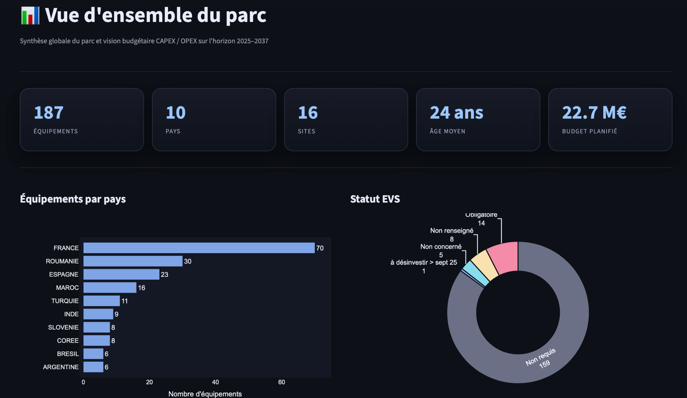
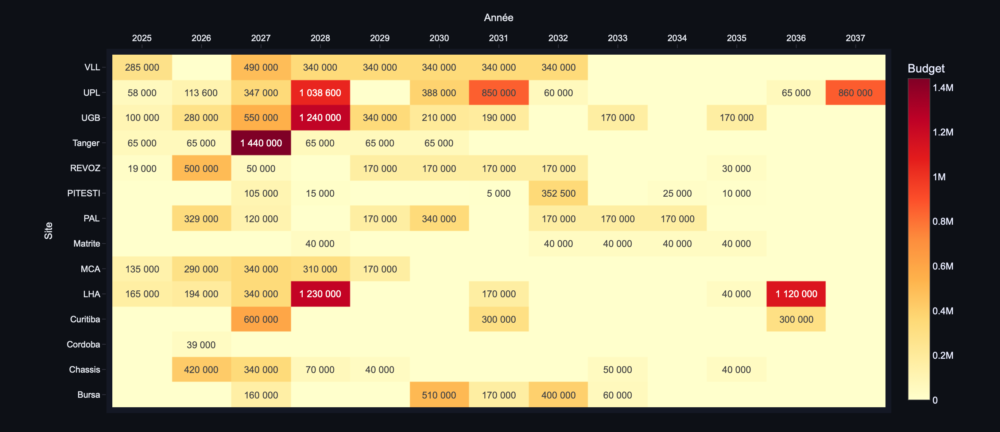

# Industrial Maintenance Dashboard

**Python and Streamlit dashboard for industrial maintenance, overhead-crane assessment, CAPEX/OPEX planning, and engineering decision support.**

[Live Streamlit app](https://industrial-maintenance-dashboard.streamlit.app)

This project was developed during my apprenticeship at **Renault Group** to improve how overhead-crane maintenance and engineering data is consolidated, analysed, prioritised, and presented.

The original information was distributed across Excel-based sources and required significant manual interpretation. The dashboard provides a single interface for importing the equipment dataset, cleaning and structuring it, calculating engineering indicators, and presenting the results to maintenance and technical teams.



## Project objective

The application was designed to make industrial equipment information easier to:

- consolidate in one place;
- clean and standardise;
- trace across sites and countries;
- analyse for maintenance and engineering decisions;
- prioritise equipment and interventions;
- visualise CAPEX/OPEX planning;
- support technical assessment of overhead cranes.

## My contribution

I developed the Python and application side of the project, including:

- Excel ingestion and preprocessing;
- data cleaning and column normalisation;
- equipment, site, and country-level aggregation;
- maintenance and budget calculations;
- Streamlit application architecture;
- interactive Plotly visualisations and KPI dashboards;
- engineering calculation utilities;
- presentation of results for technical users.

Engineering assumptions and calculation outputs were reviewed with experienced engineers to verify their technical and physical coherence.

## Main features

### 1. Excel data ingestion

The application accepts the fleet Excel file directly through the Streamlit interface and processes the uploaded dataset in memory.

The preprocessing layer handles tasks such as:

- column-name normalisation;
- removal of empty rows;
- text cleaning;
- country-name standardisation;
- numeric type conversion;
- EVS status standardisation;
- yearly budget aggregation.

### 2. Fleet overview

The overview page presents high-level indicators including:

- number of equipment items;
- number of countries;
- number of industrial sites;
- average equipment age;
- total planned budget.

It also provides interactive visualisations for equipment distribution, EVS status, CAPEX/OPEX planning, and site-level budget analysis.

### 3. Budget planning by site and year

The dashboard includes a site-by-year heatmap to make high-investment periods and locations immediately visible for planning and prioritisation.



### 4. Prioritisation

A dedicated page supports the prioritisation of equipment and engineering actions using the processed technical dataset.

### 5. Individual crane view

The application includes a dedicated equipment page for reviewing information at individual overhead-crane level.

### 6. IFm engineering calculator

A dedicated calculation page supports engineering assessment using the project methodology.

### 7. Methodology

The application contains a methodology page explaining the engineering logic used in the assessment process.

## Engineering logic

The supporting utilities include engineering classifications such as:

- FEM operating-time classes;
- load-spectrum classes;
- mechanism-group classification matrices;
- maintenance and investment-budget aggregation.

This allows the application to combine software-based data processing with industrial mechanical-engineering logic.

## Technology stack

- **Python**
- **Streamlit**
- **Pandas**
- **NumPy**
- **Plotly**
- **OpenPyXL**
- **ReportLab**

## Repository structure

```text
industrial-maintenance-dashboard/
├── Accueil.py                  # Streamlit entry point
├── utils.py                    # Shared data-processing and engineering utilities
├── Capex pont Roadmap.xlsx     # Fleet dataset used by the application
├── requirements.txt            # Python dependencies
├── README.md
├── .gitignore
├── screenshots/
│   ├── dashboard-overview.png
│   └── budget-heatmap.png
└── pages/
    ├── 1_Vue_densemble.py      # Fleet overview and KPI analysis
    ├── 2_Priorisation.py       # Equipment prioritisation
    ├── 3_Fiche_Pont.py         # Individual overhead-crane view
    ├── 4_Calculateur_IFm.py    # Engineering calculator
    └── 5_Methodologie.py       # Assessment methodology
```

## Try the deployed application

Open the [Streamlit deployment](https://industrial-maintenance-dashboard.streamlit.app), then upload `Capex pont Roadmap.xlsx` from this repository through the application interface.

## Running the application locally

### 1. Clone the repository

```bash
git clone https://github.com/hassanattout/industrial-maintenance-dashboard.git
cd industrial-maintenance-dashboard
```

### 2. Create a virtual environment

```bash
python -m venv .venv
```

Activate it on macOS/Linux:

```bash
source .venv/bin/activate
```

On Windows:

```bash
.venv\Scripts\activate
```

### 3. Install dependencies

```bash
pip install -r requirements.txt
```

### 4. Start Streamlit

```bash
streamlit run Accueil.py
```

Then import the Excel fleet file through the application interface.

## Why this project matters

The project demonstrates how Python can be used as an engineering tool rather than only as a software-development language. It combines:

- industrial maintenance;
- mechanical-engineering logic;
- data preprocessing;
- interactive visualisation;
- engineering calculations;
- operational decision support.

The goal was to turn fragmented industrial information into a usable technical tool for engineers and maintenance teams.

## Author

**Hassan Attout**  
Mechanical Engineering, Sorbonne University  
Industrial Project Engineering experience, Renault Group
